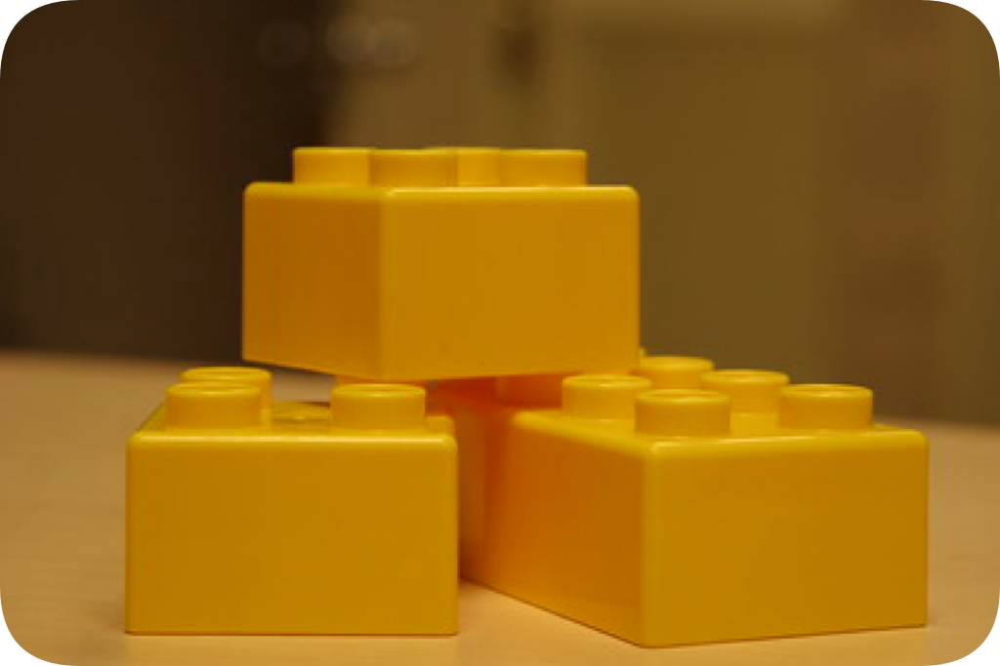

<h1 align="center"> Dendritc Design</h1>
<h3 align="center"> with the Flake Parts Framework</h3>

<h3 align="center"> A guide on how to structure your Nix code with Flake Parts using the Dendritic Pattern </h3>

  

As with many other programming languages, Nix offers numerous alternative approaches to implementing the desired outcome. While this freedom brings certain advantages, it also presents some drawbacks.

Some Nix users might find this journey relatable: 
*As a beginner, you start with a single `configuration.nix` file. However, as your requirements grow, such as managing multiple hosts, users, and self-defined services, you redesign your code structure multiple times. Each iteration makes your code increasingly complex. The complexity reaches a new level when you integrate Home-Manager into your system configuration and when you use your code simultaneously for Linux and MacOS.*

With increasing experience, you desire:
- **Reusable code** that can be easily integrated into various areas or foreign code that can be used without significant changes to your existing code.
- **Simple troubleshooting** that enables quick identification and resolution of errors in a single location.
- **A logical and easily expandable structure** that minimizes complexity and enhances manageability.

While there are software frameworks available that offer ready-made system configuration tools with precisely defined fixed structures, a more effective approach is to shift our mindset about **how we build and structure our own Nix code**, the [Dendritic Pattern](https://github.com/mightyiam/dendritic). 

This new approach eliminates the need to depend on a limited toolset that may not meet your future needs. It offers a design approach that directly addresses your pain points.

This guide aims to provide guidance on migrating existing code structures or assist you in planning a new (complex) structure from scratch. All the concepts and code snippets presented should be considered as ideas to ponder, which can always be adapted or expanded to suit your specific requirements.

For users solely relying on Nix to run a single machine, this guide may be overly detailed. However, it's beneficial for those contemplating refactoring their existing configuration, particularly when faced with design challenges arising from increased complexity.

Furthermore, this guide includes a [Comprehensive Example](guide/chapter3.md#comprehensive-example) that demonstrates the typical usage of the Dendritic Design. The example primarily focuses on illustrating the code structure aspects outlined in this guide. While it's not meant to be a direct copy template, it serves as a valuable resource for incorporating ideas into your own design.

If you have any questions before you begin, please refer to the provided [FAQ](guide/faq.md) for the Dendritic Pattern.

# Contents
- [Basics for usage of the Dendritic Pattern](guide/chapter1.md#basics-for-usage-of-the-dendritic-pattern)
  - [Libraries](guide/chapter1.md#libraries)
  - [What is a *feature* ?](guide/chapter1.md#what-is-a-feature-)
  - [File Organization](guide/chapter1.md#file-organization)
  - [The Flake Parts Framework](guide/chapter1.md#the-flake-parts-framework)
- [Design Patterns for Dendritic Aspects](guide/chapter2.md#design-patterns-for-dendritic-aspects)
  - [***Simple Aspect***](guide/chapter2.md#simple-aspect)
  - [***Multi Context Aspect***](guide/chapter2.md#multi-context-aspect)
  - [***Inheritence Aspect***](guide/chapter2.md#inheritence-aspect)
  - [***Collector Aspect***](guide/chapter2.md#collector-aspect)
  - [***Constants Aspect***](guide/chapter2.md#constants-aspect)
  - [***DRY Aspect***](guide/chapter2.md#dry-aspect)
  - [***Factory Aspect***](guide/chapter2.md#factory-aspect)
  - [Applying and Selecting Aspect Patterns](guide/chapter2.md#applying-and-selecting-aspect-patterns)
  - [Bringing it all together](guide/chapter2.md#bringing-it-all-together)
- [Comprehensive Example](guide/chapter3.md#comprehensive-example)
- [Acknowledgement and additional information](guide/chapter4.md#acknowledgement-and-additional-information)
  - [Dendritic Pattern](guide/chapter4.md#dendritic-pattern)
  - [Flake-Parts](guide/chapter4.md#flake-parts)
  - [Optional libraries](guide/chapter4.md#optional-libraries)
  - [Reference repositories utilizing the Dendritic Pattern](guide/chapter4.md#reference-repositories-utilizing-the-dendritic-pattern)
