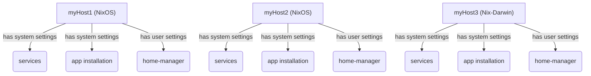
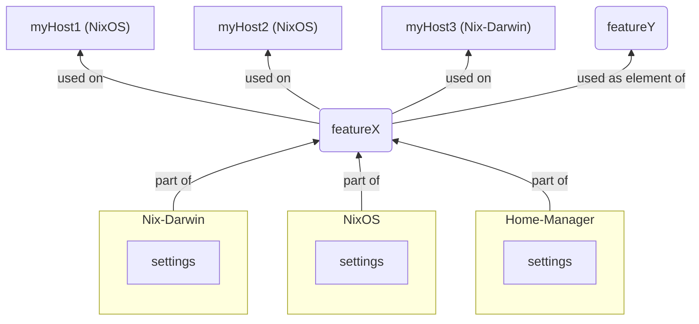

# Basics for usage of the Dendritic Pattern

This chapter offers a concise introduction to the [Dendritic Pattern](https://github.com/mightyiam/dendritic) when employed in conjunction with the [Flake Parts Framework](https://flake.parts).

The Dendritic Pattern facilitates a design approach that encapsulates features and provides them to various recipients. It represents a fundamental shift in thinking, akin to [flipping the Configuration Matrix](https://not-a-number.io/2025/refactoring-my-infrastructure-as-code-configurations/#flipping-the-configuration-matrix). Although this seemingly minor change may initially seem challenging to comprehend, its significant positive impact becomes evident as soon as you practically engage with the pattern and implement straightforward solutions to your design challenges. A comprehensive summary of the pattern's extensive advantages can be found in this excellent [Dendritic Nix Summary by Vic](https://vic.github.io/dendrix/Dendritic.html).

## Libraries

The **Dendritic Pattern**'s shift in mindset is independent of specific frameworks and libraries. While other methods exist, the Flake Parts Framework offers a highly recommended generic toolset that perfectly suits the purpose of creating a Dendritic code structure.

We will extensively utilize one part of the Flake Parts Framework, the [flake.modules option](https://flake.parts/options/flake-parts-modules.html), to structure code into blocks, which will then be combined to form larger components.

While other libraries are entirely optional, they can still be beneficial for your setup. For more information on this, refer to the chapter titled [The Flake Parts Framework](#the-flake-parts-framework).

## What is a *feature* ?
 
In an informal sense, a feature provides essential content that can be utilized in various configuration contexts.

Let's illustrate this with an example of how your typical configuration hierarchy might transform:
Instead of creating a host and assigning services, applications, and user settings to this host, we now create a *feature* that will be used on hosts. Our perspective shifts from *top-down* to *bottom-up*. A *feature* defines the attributes in the context of different areas, such as NixOS, Nix-Darwin, or Home-Manager, and it encompasses everything that is necessary. For instance, a *feature* can include settings for various system types, users, and services.

Our code will be transformed from


 
to this



Why is this concept so different from your usual approach? All your feature-related settings are consolidated, but still organized into separate blocks for different contexts. This makes it easy to make code changes and fix bugs. Managing side effects becomes much simpler. Adding new ideas to your configuration is now a breeze when you understand how to use features for specific purposes. This is the main focus of this guide (refer to chapter [Design Patterns for Dendritic Aspects](guide/chapter2.md#design-patterns-for-dendritic-aspects)). Adding or removing a specific feature to something else (e.g., any of your hosts, regardless of operating system type) often becomes a single line of code. Adding new configuration contexts like Darwin is simply adding the missing configuration to your feature in separate blocks without any code dependencies.
   
When defining *features*, you can customize the granularity and abstraction level to suit your preferences. 

Typical *feature* abstractions are used for:
- Specific services or apps (e.g., “syncthing”, “firefox”)
- Service, settings or app categories (e.g., “mailServer”, "bluetooth", “codingApps”)
- Usage areas (e.g., “desktopEnvironment”)
- Specific users or hosts (e.g., “bob”, “myServer”)
- User or host categories (e.g., “adminUser”, “officeNotebook”)
- Nix tools (e.g., “impermanence”)

A *feature* is an abstract thing, you define **what it is** (on a semantic level) and **what it does** in different configuration contexts.

Every feature, by definition, is a **module** that has access to all attributes in the highest-level configuration. This new concept may seem complicated at first, but you'll soon understand why it's necessary for the pattern work and why it's the key to many of its benefits.

## File Organization

File organization is not essential for the proper functioning of Nix when it is syntactically correct, but it significantly aids in structuring your code for easier management. Additionally, file naming is crucial for the semantic aspect of the Dendritic Pattern, as it involves gluing together a feature by giving it a name.

Here are some customizable file organization ideas:
- All features are organized in a "modules" folder, clearly indicating that each `.nix` file within is a feature module.
- Each feature must be named using its file or path name. If the code for a feature becomes too complex or extensive, it's advisable to split it into multiple files and place everything in a directory named after the feature. This practice, due to the value merging of all modules, makes file splitting very convenient. Utilize file splitting to enhance the structural clarity of your code.
- As the number of features grows, sub-directories can be used to provide additional structure, especially if a flat "modules" folder becomes confusing.
- External code (e.g., `hardware.nix`) should be extended with the appropriate Flake-Parts definition to integrate it into our feature module system, which is the preferred approach. Alternatively, it can be placed outside the the central "modules" folder and included manually.
- If a data file is exclusively used by a feature, it should be stored within that feature's directory. On the other hand, data used by multiple features can reside in a data directory located outside the feature directory. For instance, create a separate "secrets" directory that can be used by all features, in addition to the "modules" directory.
- When developing features, the location of the features directory or naming can change. Therefore, it's best practice to ensure that file references within a feature don't depend on its naming or the current directory location.
- File and directory names are arbitrary and irrelevant when using the feature code, but they hold significance for you and the overall pattern. Therefore, they can be considered documentation, so it's crucial to adhere to your naming convention.
  
## The Flake Parts Framework

The [Flake Parts Framework](https://flake.parts) serves as the foundation for structuring code. While Flake Parts is a highly versatile tool, we only use a few of its components, which are briefly outlined here to provide a starting point.

When defining a feature, we frequently want to reuse it within our hierarchical feature structure. To accomplish this, we define reusable modules by using the Flake Parts `flake.modules` attribute to store our feature building blocks.

Creating such a reusable feature building block and storing it in `flake.modules` looks like this:

```nix

flake.modules.<module class>.<aspect name> =
{
	imports = [ <list of other 'flake.modules' of same class> ];

    #
    # module code defining this `aspect`
    #
}

```
  
In most cases, the `aspect` name is the same as our feature name and can be used interchangeably. However, there are exceptions to this rule. When a feature contains multiple `aspect` definitions, I'll comment on that later.

Every `flake.modules` definition has a configuration context, known as the `<module class>`, which serves as the code's reference point. The most commonly used module classes are `nixos`, `darwin`, and `homeManager`, and these are also demonstrated in the examples. Of course, the same principle applies if you use other class types, such as `nixDroid` or `nixVim`.

`flake.modules.<module class>.<aspect>`s and features are structurally related in the following way:
- One feature can define multiple `aspects`, especially for different module classes.
- `aspects` can be nested hierarchically using `imports`, which allows us to nest features. The use of module `imports` also changes how we enable something: instead of using `enable = true;`, we simply import the module. The code within the module enables the service, etc., by default.
- A feature is sometimes more than a collection of `aspect` definitions: besides defining the structured module hierarchy, a feature sometimes defines or accesses other flake-parts attributes. Let's call these parts flake-parts boilerplate.
- All features are imported by default. This means all `aspects` are defined and all flake-part boilerplates are active. However, be aware that an `aspect` definition is just that, a definition for our module library, so it remains inactive until it is used in some flake-parts boilerplate to be accessible at the flake outputs.

Let's examine how this appears in the code of a feature:
```nix
{ # <- this is the feature module

  # 'flake.modules' module definition
  flake.modules.nixos.aspect1 = {
    
    # defining the hierarchical module structure
    imports = with inputs.self.modules.nixos; [
      aspect2
      aspect3
    ];

  };

  # using the previously defined 'aspect1' module for a system configuration (flake-part boilerplate)
  flake.nixosConfigurations = ... # nixpkgs.lib.nixosSystem using inputs.self.modules.nixos.aspect1;

}
```

> [!IMPORTANT]
> To avoid confusion, it's essential to understand the concept of module classes:
> - A module is a collection of attributes, but these attributes don't have a universal meaning. Therefore, each module has a specific domain, or context, in which it can be used. This context is known as the`<module class>`. For instance, you might already be using different `<module classes>` in your current setup, such as `homeManager class` modules within `nixos class` modules.
> - `Aspect` modules are modules of a specific configuration context (`<module class>`), such as NixOS or Darwin. Within such a module, the options of this context are accessible.
> - Features are also modules. They are used with the Flake Parts Framework to define the flake-level outputs itself. So, you can think of a feature as a module of the`<flake class>`. The Flake Parts Framework and additional tools define options (like `flake.nixosConfiguration`, `flake.perSystem.packages`, `flake.modules`) that can be used in the`<flake class>` module (feature) to define the flake-outputs. That's the beauty of the Flake Parts Framework: the flake itself becomes a configuration context, just like any other, and is now accessible within modules by using the available options.

> [!NOTE]
> - When just using the term 'modules' in this guide, `aspect` modules are referenced.
> - In other documentation, you may encounter the term "top-level module". In many instances, Flake Parts Framework modules (`<flake class>` modules) are referenced. However, the term "top-level" is ambiguous. Remember that the Dendritic Pattern is not based on any specific tool, and it's not even necessary to use it with flakes at all. Sometimes, "top-level" refers to another top-level configuration belonging to a different class. To avoid confusion, this guide refrains from using the term "top-level module" and instead refers to `feature modules` for the used Flake Parts Framework modules (`<flake class>` modules) that are in the focus of this guide.

> [!WARNING]
> When importing `aspect` modules within other `aspect` modules to establish a hierarchy, it's essential to be aware of the following pitfalls:
> - Module imports are typed based on their `class`. For instance, importing a `nixos` module into a `darwin` module would result in an error. If a module needs to be imported into multiple module classes, you can use the `generic` module class. An example is a `flake.modules.generic.nix-settings` module, which can be used in both NixOS and Darwin contexts.
> - Imports **must not** be made conditionally (e.g., using `lib.mkIf`). This is a standard Nix restriction because Nix encounters issues evaluating recursions. To avoid the need for conditional imports, you can redesign your module structure. Alternatively, you can make the creation of the module's content (whole or parts) dependent on the condition. In this case, importing will always be unconditional, but the content of the import may vary based on the conditions.
> - Avoid importing modules multiple times, as this can lead to unwanted side effects. Define your logical structure in a way that ensures modules are imported only once in one hierarchy path, not simultaneously at multiple locations within the same path.

By default, all feature modules are imported at the `flake.nix` file. Instead of manually importing each file, the collection folder "modules" (the home of all our features) becomes convenient. We simply need to import all `.nix` files from this folder recursively. Therefore, it's essential that all the files in the folder are feature modules.

The import is accomplished with a few lines of Nix code. Alternatively, you can use the [vic/import-tree](https://github.com/vic/import-tree) tool, which, as a bonus, also excludes all files and folders with a name prefix of "`_`" from the import. This can be particularly useful for disabling unfinished code or code that is not a `<flake class>` (feature) module.

The import of all feature modules can be accomplished as follows:
```nix
outputs = inputs: inputs.flake-parts.lib.mkFlake { inherit inputs; } (inputs.import-tree ./modules);
```

Another useful tool from the same author takes it a step further by embedding the content of the `flake.nix` file directly into the code. While the use of [vic/flake-file](https://github.com/vic/flake-file) is optional, it provides the advantage of incorporating the changes to your `flake.nix` required by a feature into the local code of that feature. Consequently, the `flake.nix` file will be automatically generated, eliminating the need for manual editing. This approach aligns perfectly with the concept that all relevant information about a feature is defined within it. However, it's important to regenerate the `flake.nix` file using the command `nix run .#write-flake` every time you add new flake inputs to a feature.

> [!NOTE]
> [vic/import-tree](https://github.com/vic/import-tree) and [vic/flake-file](https://github.com/vic/flake-file) will be used in the example code snippets.

> [!TIP]
With the flake-file tool, you no longer have to edit the `flake.nix` file manually. However, there's an exception: if you accidentally create a faulty `flake.nix` file, such as by making a typo in an input URL, the new flake.nix generation will fail. To resolve this issue, you need to fix the error in the `flake.nix` file, not just the `flake-file` setting. Once you make the necessary changes, the `flake.nix` file will be generated successfully.

Flake-Parts and, if necessary, other Nix tool libraries must be set up. Here's an example of how it looks:
```nix
  flake-file.inputs = {
    flake-parts.url = "github:hercules-ci/flake-parts";
    flake-file.url = "github:vic/flake-file";
    import-tree.url = "github:vic/import-tree";
  };

  imports = [
    inputs.flake-parts.flakeModules.modules
    inputs.flake-file.flakeModules.default
  ];

  systems = [
    "aarch64-darwin"
    "aarch64-linux"
    "x86_64-darwin"
    "x86_64-linux"
  ];
``` 

> [!TIP]
> The [flake-file](https://github.com/vic/flake-file?tab=readme-ov-file#flakemodulesdendritic) tool has also a `flakeModule.dendritic` module included, which conveniently sets up flake-file, import-tree, flake-parts and sets `outputs` to import all `./modules`.

When creating configurations (in our boilerplate parts), we need a few lines of code that we can store in a personal library for convenience. For instance, for nixosConfigurations, we can create something like this:

```nix
  mkNixos = system: name: {
    ${name} = inputs.nixpkgs.lib.nixosSystem {
      modules = [
        inputs.self.modules.nixos.${name}
        { nixpkgs.hostPlatform = lib.mkDefault system; }
      ];
    };
  };
```
Now, we have all the necessary components ready to construct our configurations out of features using `aspect` modules as the building blocks.

---
[Table of Contents](/README.md#contents) | [Next Chapter >>](chapter2.md#design-patterns-for-dendritic-aspects)

Quick access:
- [Basics for usage of the Dendritic Pattern](chapter1.md#basics-for-usage-of-the-dendritic-pattern)
- [Design Patterns for Dendritic Aspects](chapter2.md#design-patterns-for-dendritic-aspects)
- [Comprehensive Example](chapter3.md#comprehensive-example)
- [Acknowledgement and additional information](chapter4.md#acknowledgement-and-additional-information)
